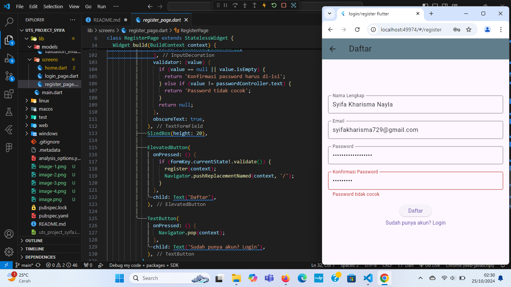

# LAPORAN UTS Pemrograman Perangkat Bergerak

Nama: Syifa Kharisma Nayla
NIM: 362358302019
Kelas: 2B TRPL

1. Halaman registrasi (RegisterPage)
Program ini menghasilkan halaman registrasi yang memungkinkan pengguna untuk membuat akun baru. Pengguna harus memasukkan informasi seperti nama lengkap, email, password, dan konfirmasi password. Jika semua input valid dan email belum terdaftar, maka data pengguna baru akan disimpan di database, dan pengguna akan diarahkan ke halaman utama. 
Hasil Program:

Jika ada kesalahan, seperti email sudah terdaftar atau password tidak cocok, maka akan ditampilkan pesan kesalahan yang sesuai.
Hasil: Program:

2. Tampilan masuk (LOGIN) ke aplikasi
Program ini akan menampilkan halaman login dengan dua kolom input (email dan password). Ketika tombol "Login" ditekan, program akan memverifikasi apakah email dan password yang dimasukkan cocok dengan data pengguna di database. Jika cocok, pengguna diarahkan ke halaman beranda. 
Hasil Program:

Jika tidak, ditampilkan pesan kesalahan. Ada juga opsi untuk mendaftar jika pengguna belum memiliki akun.
Hasil Program:

3. Tampilan utama (HOME)
Aplikasi ini akan menghasilkan sebuah halaman utama dengan latar belakang berwarna biru keabu-abuan, menampilkan pesan selamat datang dan nama "Syifa Kharisma" Di bawah teks tersebut.
Hasil Program:

Terdapat tombol "Keluar" yang ketika ditekan akan mengembalikan pengguna ke halaman sebelumnya.
Hasil Program:

4. main.dart
Program ini mengatur navigasi antar tiga halaman:
Login Page (LoginPage): Halaman awal di mana pengguna dapat masuk dengan email dan password.
Register Page (RegisterPage): Halaman pendaftaran untuk membuat akun baru, diakses dari halaman login.
Home Page (Home): Halaman utama yang ditampilkan setelah pengguna berhasil login.
Program:

5. Kesimpulan:
Aplikasi ini mengilustrasikan konsep dasar dari aplikasi mobile yang melibatkan autentikasi pengguna. Struktur dan logika yang sederhana namun fungsional menunjukkan cara membangun aplikasi yang memanfaatkan form validation, navigasi multi-halaman, dan manipulasi data secara lokal.